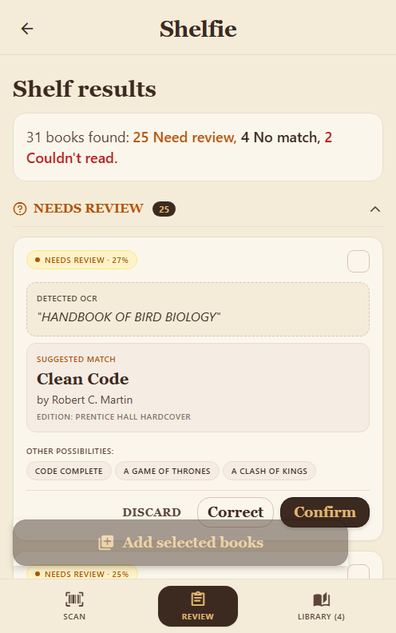
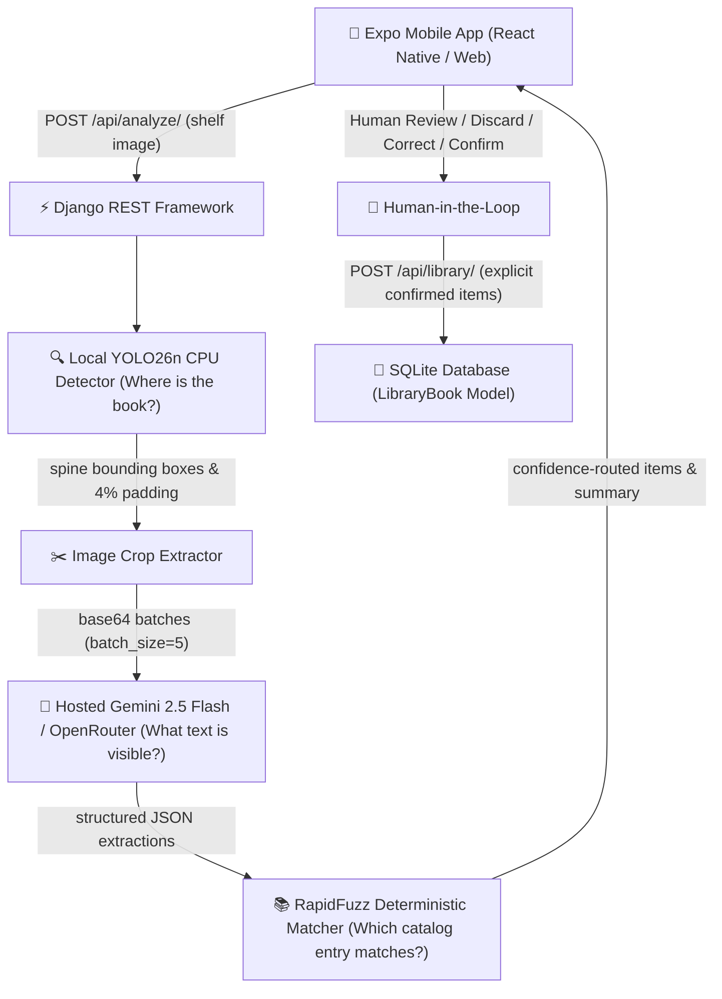

# Shelfie — AI Bookshelf Scanner & Personal Library Builder

Shelfie turns a photograph of a physical bookshelf into a structured digital personal library. It runs local object detection to locate book spines, extracts cropped spine images, transcribes titles and authors with a hosted vision-language model, matches transcriptions deterministically against a messy catalog, and provides a human-in-the-loop review interface before persisting confirmed books to local storage.

---

## Application Walkthrough & Screenshots

The user interface uses an archival editorial aesthetic (linen canvas, debossed leather action buttons, serif display typography, and restrained status badges) constrained to a centered mobile-first shell.

| Scan Bookshelf | Results & Review | Personal Library |
| :---: | :---: | :---: |
|  |  |  |
| *Initial scan screen with photo picker, instructions, and library shortcut* | *Real shelf analysis results with confidence routing, OCR boxes, and alternative match chips* | *Populated personal library with edition badges, catalog IDs, and search filter* |

---

## System Architecture



---

## Why This Architecture?

Shelfie maintains strict separation of concerns across each pipeline stage:

1. **Local Vision Model (YOLO26n on CPU)** answers **WHERE** books are by extracting individual spine bounding box coordinates. Running locally on CPU requires zero external API cost for detection.
2. **Hosted Vision-Language Model (`google/gemini-2.5-flash` via OpenRouter)** answers **WHAT TEXT** is physically printed on each spine (`crop_id`, `title`, `author`, `readability`). VLM prompts output strict JSON Schema and never access or guess internal catalog IDs.
3. **Deterministic Matcher (RapidFuzz against `catalog.csv`)** answers **WHICH CANONICAL ENTRY** corresponds to the transcription using normalized Levenshtein token matching, publication margin analysis, and author-conflict safeguards.
4. **Human-in-the-Loop** decides **WHAT TO PERSIST** when confidence is low, ambiguous editions exist, or titles are unreadable.
5. **Database (SQLite `LibraryBook`)** persists **CONFIRMED BOOKS ONLY**. Scans are transient in memory until explicitly saved.

---

## Technology Stack

- **Mobile Frontend**: React Native `0.86.2`, Expo `57.0.12`, TypeScript `6.0.3`, React Native Web `0.21.2`
- **Backend Framework**: Python `3.11`, Django `5.2.17`, Django REST Framework `3.18.0`, django-cors-headers `4.9.0`
- **Local Vision**: Ultralytics `YOLO26n` (`8.4.119`), PyTorch CPU `2.13.0`, OpenCV `5.0.0`, Pillow `12.3.0`
- **Hosted Vision-Language**: OpenRouter API with `google/gemini-2.5-flash`, HTTPX `0.28.1`
- **Catalog Matching**: RapidFuzz `3.14.5` (C++ Levenshtein distance)
- **Persistence**: SQLite (Django ORM `LibraryBook`)
- **Testing**: pytest `9.1.1`, pytest-django `4.14.0`

---

## Quick Start

### 1. Backend Setup

```bash
# Clone repository and navigate to root
git clone https://github.com/RishiP44/MealVue.git
cd MealVue

# Create and activate Python virtual environment
python -m venv .venv

# Windows PowerShell:
.\.venv\Scripts\Activate.ps1
# Unix / macOS:
source .venv/bin/activate

# Install production dependencies
pip install -r backend/requirements.txt

# Configure environment variables
cp .env.example .env
# Edit .env and supply your OPENROUTER_API_KEY (needed only for live VLM analysis)

# Apply SQLite database migrations
python backend/manage.py migrate

# Start Django development server
python backend/manage.py runserver 127.0.0.1:8000
```

> **Note**: Pretrained `yolo26n.pt` detector weights download automatically on first run via Ultralytics if not already cached locally.

### 2. Mobile Frontend Setup

```bash
# In a separate terminal, navigate to mobile directory
cd mobile

# Install dependencies from lockfile
npm ci

# Start Expo development server (Web or Native)
npx expo start --web
```

- **Web Browser**: Opens automatically at `http://localhost:8081` (or next available port).
- **Physical Mobile Device**: Set `EXPO_PUBLIC_API_URL=http://YOUR_COMPUTER_LOCAL_IP:8000` in `mobile/.env` so your mobile device can reach the Django backend over your local Wi-Fi network.

---

## REST API Specification

| Method | Endpoint | Description | Auth |
| :--- | :--- | :--- | :--- |
| `GET` | `/api/health/` | Service health status (`{"status": "ok"}`). | None |
| `POST` | `/api/analyze/` | Upload bookshelf image (`multipart/form-data`) for full end-to-end pipeline analysis. | None |
| `POST` | `/api/match/` | Re-run deterministic matching on user-corrected title/author text. | None |
| `GET` | `/api/library/` | Retrieve all saved library books ordered by `-added_at`. | None |
| `POST` | `/api/library/` | Persist single or batch confirmed books (`{"books": [...]}`) to SQLite. | None |

---

## Deterministic Matching & Decision Confidence

Shelfie explicitly distinguishes between raw text similarity and system decision confidence:

$$\text{Decision Confidence} = f(\text{match\_score}, \text{margin\_to\_runner\_up}, \text{author\_agreement})$$

- **Unique Unambiguous Match** ($\text{confidence} \ge 0.85$): Automatically routed to `matched` (pre-selected for addition).
- **Ambiguous Work / Multiple Editions** ($\text{confidence} < 0.85$): Even when `match_score` is 1.0 (e.g. *"The Hobbit"* matching both 1937 UK Paperback and 75th Anniversary Hardcover with `margin = 0.0`), decision confidence drops to `0.50` and the book is routed to `needs_review` for human confirmation.
- **Author Conflict Safeguards**: If a title matches closely but the author strongly contradicts (e.g. *"1984"* by *"Aldous Huxley"*), the score is capped to prevent false positive matches against George Orwell's work.

---

## Human-in-the-Loop Review Workflow

Analysis results are partitioned into 5 explicit states:

1. **`matched`**: High-confidence canonical match ($\ge 0.85$). Pre-selected; user can deselect or modify before persistence.
2. **`needs_review`**: Transcribed text matched multiple catalog candidates or has moderate confidence ($0.45 \le \text{conf} < 0.85$). User can Confirm suggested match, Discard, or Correct details.
3. **`unmatched`**: Text read successfully, but no confident candidate exists in `catalog.csv` ($\text{conf} < 0.45$). User can search the catalog manually or add the book directly to their personal library.
4. **`unreadable`**: Spine text is severely blurred, angled, or obscured. User can enter title and author manually or discard.
5. **`extraction_failed`**: Provider timeout, rate limit, or network failure on a specific crop. Unaffected crops in the scan remain accessible.

---

## Empirical Benchmarks

### 1. Local Book Detector Benchmark (CPU)

Measured on 5 diverse test photographs (242 visible book spines) with `imgsz=1280` on CPU:

| Detector Model | Confidence | Total Detections | Usable Spines Found | Precision | Latency / Image | Model Footprint |
| :--- | :--- | :--- | :--- | :--- | :--- | :--- |
| **YOLO26n (Selected)** | **0.20** | **94** | **38 / 242** | **40.4%** | **340.59 ms** | **5.3 MB** |
| YOLO26s | 0.20 | 85 | 31 / 242 | 36.5% | 710.22 ms | 18.8 MB |
| Grounding DINO Tiny | 0.25 | 17 | 17 / 242 | 100.0% | 11,143.74 ms | 693.0 MB |

> *Note: Evaluation evaluates individual usable spine crops suitable for OCR. YOLO26n was selected for its 32.7x faster inference speed and 130x smaller footprint over Grounding DINO on CPU.*

### 2. Hosted Vision-Language Extraction Benchmark (`Gemini 2.5 Flash`)

Measured across 12 representative book spine crops via OpenRouter:

| Configuration | Total Crops | Request Count | Wall-Clock Latency | Total Tokens | Provider Cost |
| :--- | :--- | :--- | :--- | :--- | :--- |
| **Batched (`batch_size=5`)** | **12** | **3** | **1,734.24 ms** | **2,476** | **$0.001445 USD** |
| Unbatched (`batch_size=1`) | 12 | 12 | 6,429.40 ms | 4,780 | $0.002820 USD |

> *Batching achieves a **3.71x wall-clock speedup** and **48.2% token/cost reduction**.*

### 3. Full End-to-End Pipeline Smoke Test

Measured on public-domain test shelf `test-images/shelf_easy.jpg` (31 books):

- **Local Detection (YOLO26n CPU)**: `735.13 ms`
- **Crop Extraction & Prep**: `1.09 ms`
- **Hosted VLM Extractions (7 batches)**: `13,650.42 ms`
- **Deterministic Matching (RapidFuzz)**: `330.57 ms`
- **Total Server Pipeline Time**: `14.717s` (Total wall-clock: `14.74s`)
- **Total Provider Cost**: `$0.007264 USD` (< 1 cent)
- **Item Breakdown**: 31 detected (0 matched, 25 needs_review, 4 unmatched, 2 unreadable, 0 extraction_failed)

---

## Automated Verification & Test Suite

All unit and integration tests run entirely locally with **zero paid API calls** (external VLM calls are mocked):

```bash
# Run backend test suite (72 unit & integration tests)
pytest backend

# Run mobile TypeScript compilation check
cd mobile && npx tsc --noEmit

# Run mobile production web build export
npx expo export --platform web
```

**Verification Results**:
- `pytest backend`: **72 passed in 3.65s** (100% passing)
- `npx tsc --noEmit`: **0 errors**
- `npx expo export --platform web`: **Exported `dist/` in 5.1s**

---

## Failure Handling & Edge Case Hardening

- **Bad Uploads**: Missing file, 0-byte file, corrupt image, or oversized payload (>15MB) returns HTTP 400 with a consistent JSON error envelope (`error.code` and `error.message`).
- **No Books Detected**: Returns HTTP 200 with `status: "no_books_detected"`, skipping VLM and matcher calls, and presenting a helpful guidance state.
- **Partial Pipeline Success**: Individual crop VLM failures (e.g. timeout on a single batch) do not crash the scan; unaffected books are presented normally.
- **Provider Outages & Rate Limits**: Bounded retries with exponential backoff on HTTP 429/500/503; immediate non-retriable failure on 401/403.
- **Server Offline**: Client-side network interceptor displays friendly connection guidance (*"We couldn't connect to Shelfie. Please check that the server is running and try again."*) instead of raw technical fetch stack traces.
- **Double Submission**: Analyze Shelf and Add Books buttons have active in-flight guards preventing duplicate concurrent submissions.

---

## Known Limitations & Tradeoffs

1. **Generic Pretrained Object Detector**: Generic COCO-trained YOLO models have moderate single-spine recall on dense, dark, or angled bookshelves compared to specialized fine-tuned spine segmenters. This is an intentional take-home tradeoff prioritizing zero training overhead.
2. **Local CPU Inference Latency**: Local YOLO26n detection takes ~350–750ms on CPU. Production systems would deploy ONNX Runtime or GPU acceleration.
3. **Transient Scan Lifecycle**: Scanned books remain in client memory during the review session and are persisted to SQLite only when explicitly confirmed.
4. **Web Camera Sandboxing**: In web browsers, security restrictions require selecting images via file picker rather than direct camera hardware stream.

---

## Provenance & Disclosures

- **AI Usage Disclosure**: Full accounting of AI tools used during development is documented in [AI_USAGE.md](AI_USAGE.md).
- **Test Image Provenance**: Public-domain sources and CC0 licensing for all test photographs are documented in [test-images/README_TEST_IMAGES.md](test-images/README_TEST_IMAGES.md).
- **Adversarial QA Report**: Complete test matrices and defect hardening records are documented in [docs/QA_REPORT.md](docs/QA_REPORT.md).
