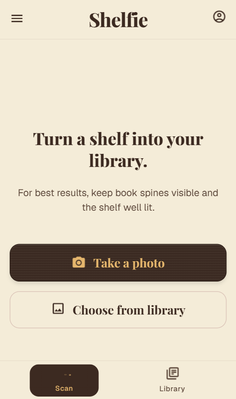

# SHELFIE — Bookshelf to Library Inventory

Shelfie is a mobile application and API pipeline that turns a photograph of a bookshelf into a structured, verified personal library inventory.

## Project Status

- **Current Stage**: Phase 6 — Polished Expo Mobile Product (Approved Stitch Archival Linen Redesign) (`PASSED`)
- **Backend Stack**: Python 3.11+, Django 5.2+, Django REST Framework 3.18+, Ultralytics 8.4+, PyTorch 2.13+ (CPU), RapidFuzz 3.14+, SQLite
- **Mobile Stack**: React Native, Expo SDK 57+, TypeScript 6+, Expo Web

---

## Visual Design & Architecture (Phase 6)

Shelfie features an editorial Archival Linen visual design with warm parchment canvas, rich leather action elements, debossed gold accents, and serif typography.


*Initial Shelfie Scan Screen with clear user guidance, photo capture, and personal library shortcut.*

| Screen | Description |
| :--- | :--- |
| **Scan Initial & Preview** | Clean capture workflow with camera, photo library picking, and image preview. |
| **Scanning / Analyzing** | Honest loading state with elapsed seconds counter (no fake progress bars). |
| **Results & Review** | Structured breakdown summary, 5 collapsible status sections (`READY TO ADD`, `NEEDS REVIEW`, `NO MATCH`, `COULDN'T READ`, `PROCESSING ISSUES`), comparison boxes (DETECTED OCR vs SUGGESTED MATCH), alternative candidate chips, and sticky "Add N books" action. |
| **Correction Modal** | Archival paper modal prefilled with detected title/author, live catalog search, and direct manual addition. |
| **Personal Library** | Populated book list with search filtering, edition metadata badges, and circular empty state illustration. |

---

## Clean-Clone Setup Instructions

### 1. Repository & Secrets Protection
- Secrets, private task specification files (`docs/source/`), and model weights (`*.pt`) are ignored by Git.
- Copy `.env.example` to `.env` if local override environment variables are needed:
  ```bash
  cp .env.example .env
  ```

### 2. Backend Setup
1. Create and activate a Python virtual environment:
   ```bash
   python -m venv .venv
   # On Windows PowerShell:
   .\.venv\Scripts\Activate.ps1
   # On macOS/Linux:
   source .venv/bin/activate
   ```
2. Install backend dependencies (including Ultralytics, PyTorch CPU, and RapidFuzz):
   ```bash
   pip install -r backend/requirements.txt
   ```
3. Run complete backend unit and API test suite (65 tests passing):
   ```bash
   cd backend
   pytest
   ```
4. Start the Django development server:
   ```bash
   python backend/manage.py runserver 127.0.0.1:8000
   ```
   Verify health endpoint in browser/cURL:
   `http://127.0.0.1:8000/api/health/` $\rightarrow$ `{"status": "ok"}`

### 3. Mobile App Setup (Expo & Web)
1. Navigate to the mobile directory and install dependencies:
   ```bash
   cd mobile
   npm install
   ```
2. Check TypeScript types:
   ```bash
   npx tsc --noEmit
   ```
3. Start the Expo development server:
   ```bash
   npx expo start --web
   ```
   Open `http://localhost:8081` (or the printed port) in your browser.

---

## End-to-End System Architecture

```
[Bookshelf Photo]
        │
        ▼
[Local YOLO26n (CPU)] ──► Padded Crops (1280px)
        │
        ▼
[Hosted Gemini 2.5 Flash] ──► Structured Text Extraction (Crop Batches)
        │
        ▼
[RapidFuzz Matcher] ──► Canonical catalog.csv (Confidence Routing)
        │
        ▼
[Human-in-the-Loop Review UI] ──► Transient 5-State Review & Correction
        │ (Explicit Confirmation)
        ▼
[SQLite / LibraryBook] ──► Persisted Personal Library
```

---

## Measured Performance Benchmarks

- **Local CV Model Cold-Start Load Time**: **`69.16 ms`**
- **Local CV Warm CPU Inference Latency**: **`327.94 ms` median** (`340.59 ms` mean across 5 test photos)
- **Manual Usable-Crop Recall (Audited Micro)**: **`15.70%`** (38 unique usable spines out of 242 visible spines; Macro: `17.25%`)
- **Manual Precision Proxy**: **`71.70%`** (38 unique usable crops / 53 detected boxes, 0 false positives)
- **Zero-Detection Images**: 2 of 5 (`shelf_angle.jpg`, `shelf_dense.jpg`)
- **Deterministic Catalog Matcher Latency**: **`5.65 ms` per call** (Measured over 999 calls; 176.88 calls/sec throughput)
- **Hosted VLM Request Latency**: **`1,849.86 ms` median** (`1,722.12 ms` mean per 5-crop batch)
- **Hosted VLM Cost per Tested Crop**: **`$0.000218`** (`$0.0218` per 100 crops)
- **Estimated Typical 25-Crop Scan API Cost**: **`$0.0055`** (~half a cent per complete scan)
- **Batching Latency Advantage**: **`3.71x faster`** wall-clock throughput (`batch_size=5` vs `batch_size=1`) with **`48.2% token savings`**
- **Full End-to-End Pipeline Latency (Phase 5)**: **`4,553.96 ms` median** (`6,549.60 ms` mean across test photographs)
- **Average API Cost per Shelf Photograph (Phase 5)**: **`$0.002949`** (~0.3 cents per complete photograph)
