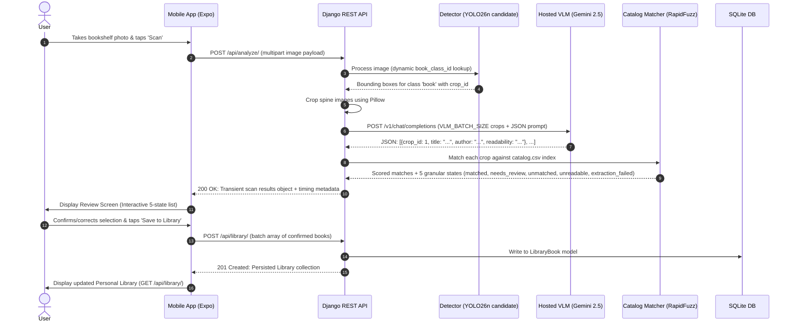
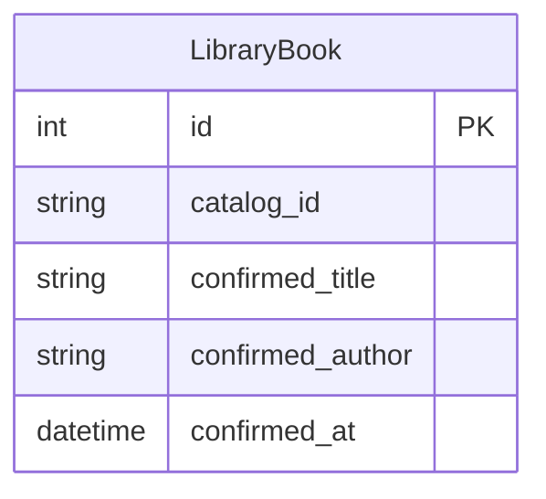

# ARCHITECTURE SPECIFICATION & SYSTEM DESIGN — SHELFIE

## 1. SYSTEM CONTEXT & HIGH-LEVEL ARCHITECTURE

Shelfie follows a hybrid edge-and-cloud multi-stage computer vision architecture:

```
+-----------------------------------------------------------------------------------+
|                                 MOBILE FRONTEND                                   |
|                        React Native + Expo (TypeScript)                           |
|                                                                                   |
|   +-----------------------+     +-----------------------+                         |
|   |  Camera / Photo Pick  |     |  Review / Human Loop  |                         |
|   +-----------+-----------+     +-----------^-----------+                         |
|               |                             |                                     |
+---------------+-----------------------------+-------------------------------------+
                | POST /api/analyze/          | JSON Scan Results
                v                             |
+---------------------------------------------+-------------------------------------+
|                                 BACKEND API                                       |
|                    Django REST Framework (Python 3.11+)                           |
|                                                                                   |
|   +---------------------------------------------------------------------------+   |
|   | 1. CV Detection Service (Local CPU)                                       |   |
|   |    Ultralytics YOLO26n (Dynamic class lookup for 'book') -> Spine Crops   |   |
|   +------------------------------------+--------------------------------------+   |
|                                        | Bounding Box Crops (crop_id)             |
|   +------------------------------------v--------------------------------------+   |
|   | 2. Hosted VLM Service (Cloud API via OpenRouter)                          |   |
|   |    google/gemini-2.5-flash (VLM_BATCH_SIZE) -> Structured OCR Text        |   |
|   +------------------------------------+--------------------------------------+   |
|                                        | Raw Title/Author & Readability           |
|   +------------------------------------v--------------------------------------+   |
|   | 3. Catalog Matcher Service (In-Memory catalog.csv Index)                  |   |
|   |    RapidFuzz Normalization & Ambiguity Margin Engine -> Confidence States |   |
|   +------------------------------------+--------------------------------------+   |
|                                        |                                          |
|   +------------------------------------v--------------------------------------+   |
|   | 4. SQLite Database Persistence (Minimal ORM)                              |   |
|   |    LibraryBook Model (Confirmed Books Only; Scan State Transient)        |   |
|   +---------------------------------------------------------------------------+   |
+-----------------------------------------------------------------------------------+
```

---

## 2. COMPONENT RESPONSIBILITY BOUNDARIES

To ensure clean architecture and testability, components adhere strictly to single-responsibility boundaries:

| Component | Responsible Engine | Primary Input | Output / Product Role |
| :--- | :--- | :--- | :--- |
| **Object Detector** | Pretrained YOLO26n Candidate (CPU) | Full Bookshelf Image | Bounding Box Crop Coordinates + `crop_id` (**WHERE** books are) |
| **Spine VLM** | OpenRouter `gemini-2.5-flash` | Batched Crop Images (`VLM_BATCH_SIZE`) | Extracted Raw Text & Readability (**WHAT** text is visible) |
| **Catalog Matcher** | RapidFuzz + Rules Engine | Extracted Text + `catalog.csv` Index | Candidate Entry & Confidence (**WHICH** catalog item corresponds) |
| **Human Reviewer** | Mobile React Native UI | Transient Scan Results | Verified Selection (**WHAT** user approves/corrects) |
| **Library Store** | Django ORM + SQLite | Confirmed Match Array | Persistent User Collection (`LibraryBook` ORM Model) |

---

## 3. END-TO-END REQUEST LIFECYCLE



---

## 4. DEEP DIVE: COMPUTER VISION DETECTION STRATEGY

### 4.1 Dynamic Label Lookup (No Hard-coded Class IDs)
- Ultrasonic YOLO COCO label maps assign `book` to class ID 73. However, implementation **MUST NOT** hard-code numeric IDs.
- Resolution must occur dynamically conceptually via:
  ```python
  book_class_id = next(
      class_id for class_id, name in model.names.items()
      if name.lower() == "book"
  )
  ```

### 4.2 Development-Time Benchmarking & Selection Workflow
Do NOT build a runtime system that automatically toggles between models. Instead, select ONE final model during development:
1. Primary candidate: `Ultralytics YOLO26n` (`yolo26n.pt`) on CPU at `imgsz=1280`.
2. Executed confidence threshold sweep (`conf = 0.10, 0.15, 0.20, 0.25`) across 5 diverse test bookshelf photographs.
3. Evaluated `YOLO26s` (`yolo26s.pt`) and `YOLOv8n` (`yolov8n.pt`) as baseline comparisons.
4. Genuinely loaded and benchmarked open-vocabulary `IDEA-Research/grounding-dino-tiny` on CPU across multiple prompt variants (`"book spine."`, `"book."`, `"individual book spine."`). Measured Grounding DINO at 11,143.74 ms warm CPU latency, 693 MB weights, and 7.02% micro recall (17 usable crops).
5. Selected `YOLO26n` (`yolo26n.pt`) operating at `conf = 0.20` as the final single local detector: delivers 38 unique usable spine crops (15.70% micro recall, 17.25% macro recall), 71.70% precision proxy, 0 false positives, 340.59 ms average CPU latency, and a compact 5.3 MB footprint with zero external dependencies.

### 4.3 Open Source License Note
YOLO26 is released under the AGPL-3.0 license. This choice represents an explicit take-home/portfolio tradeoff to leverage state-of-the-art pretrained weights. In a commercial/proprietary environment, licensing would require separate legal review or replacement with a permissively licensed alternative.

---

## 5. DEEP DIVE: HOSTED VLM STRATEGY

### 5.1 Provider, Model & Configurable Batching
- **Provider**: OpenRouter API (`https://openrouter.ai/api/v1/chat/completions`).
- **Configured Model**: `google/gemini-2.5-flash` via `VLM_MODEL` environment variable.
- **Configurable Batching**: `VLM_BATCH_SIZE=5` (batches up to 5 base64 JPEG crops per single API call).
- **Empirical Batching Speedup**: Benchmarking proved `batch_size=5` delivers a **3.71x latency speedup** and **48.2% token savings** compared to individual 1-by-1 requests.
- **Stable Tracking**: Every crop payload includes a stable `crop_id` so VLM responses map back unambiguously to local detection coordinates.

### 5.2 Structured Output Schema & Local Validation
- Uses strict OpenRouter JSON schema:
  ```json
  {
    "type": "json_schema",
    "json_schema": {
      "name": "book_spine_extractions",
      "strict": true,
      "schema": {
        "type": "object",
        "properties": {
          "books": {
            "type": "array",
            "items": {
              "type": "object",
              "properties": {
                "crop_id": {"type": "string"},
                "title": {"type": ["string", "null"]},
                "author": {"type": ["string", "null"]},
                "readability": {"type": "string", "enum": ["readable", "partial", "unreadable"]}
              },
              "required": ["crop_id", "title", "author", "readability"],
              "additionalProperties": false
            }
          }
        },
        "required": ["books"],
        "additionalProperties": false
      }
    }
  }
  ```
- Local defensive validation verifies `books` list, flags missing crops as `extraction_failed` (`missing_from_response`), safely ignores unknown IDs, and captures token counts & provider-reported costs.

### 5.3 Decoupling VLM Readability from Catalog Match Confidence
- `VLM extraction certainty != catalog match confidence`.
- VLM is responsible ONLY for transcribing visible text and returning a basic `readability` state (`readable`, `partial`, `unreadable`).
- The VLM must NOT own or influence canonical catalog matching.

---

## 6. DEEP DIVE: DETERMINISTIC CATALOG MATCHING ENGINE

### 6.1 Text Normalization
VLM transcriptions and `catalog.csv` records pass through `normalize_text()` (lowercasing, accent stripping via NFKD, punctuation removal, whitespace collapsing).

### 6.3 RapidFuzz Comparison & Heuristic Decision Confidence
Given a VLM transcription ($T_{vlm}, A_{vlm}$) and catalog entry $C_k$:

1. **Title Similarity Score ($S_{title}$)**:
   - Evaluates normalized input against canonical and alternate titles using $0.50 \times \text{token\_set\_ratio} + 0.50 \times \text{token\_sort\_ratio}$. Length mismatches are penalized to prevent raw substring inflation. Exact match after stripping leading articles ('the', 'a', 'an') returns $1.0$.

2. **Author Similarity Score ($S_{author}$)**:
   - Evaluates normalized input against canonical author and author aliases using $0.60 \times \text{token\_set\_ratio} + 0.40 \times \text{token\_sort\_ratio}$. Supports `Lastname, Firstname` formatting.

3. **Composite Match Score ($S_{composite}$ / `match_score`)**:
   $$S_{composite} = (0.70 \times S_{title}) + (0.30 \times S_{author})$$
   - *Author Conflict Guard*: If $S_{title} \ge 0.60$ and $S_{author} < 0.35$, $S_{composite}$ is capped at $0.45$.
   - *Title Mismatch Guard*: If $S_{title} < 0.50$, $S_{composite}$ is capped at $0.45$.

4. **Decision Confidence Heuristic (`confidence`) vs Similarity (`match_score`)**:
   - `match_score`: Similarity strength of top candidate ($S_1$).
   - `runner_up_score`: Similarity strength of second-best candidate ($S_2$).
   - `margin`: $\Delta = S_1 - S_2$.
   - `confidence`: Decision confidence in selecting the best catalog entry, incorporating ambiguity margin:
     $$\text{confidence} = S_1 \times \left(0.50 + 0.50 \times \min\left(1.0, \frac{\Delta}{\text{MIN\_MARGIN}}\right)\right)$$
   - An exact tie ($S_1=1.0, S_2=1.0, \Delta=0.0$) yields $\text{confidence} = 0.5000$ (low decision confidence) and routes to `needs_review`.

### 6.4 Thresholds (Heuristically Tuned Against Test Matrix)
- `MATCH_THRESHOLD = 0.80`
- `REVIEW_THRESHOLD = 0.45`
- `MIN_MARGIN = 0.12`

---

## 7. GRANULAR FAILURE-STATE TAXONOMY

The pipeline enforces 5 mutually exclusive, explicit states for each crop item:

1. **`matched`**: Strong candidate score ($S_1 \ge 0.82$) and unambiguous margin ($\Delta \ge 0.15$). Presented and pre-selected in the review workflow; requires explicit user action to persist.
2. **`needs_review`**: Plausible match ($S_1 \ge 0.50$), but margin or score requires human confirmation.
3. **`unmatched`**: Extraction succeeded, but no catalog match score reached $0.50$.
4. **`unreadable`**: Crop processed successfully by VLM, but physical text is illegible/degraded.
5. **`extraction_failed`**: VLM HTTP timeout, network error, or malformed provider output on specific crop. *(Crucial rule: Never label a network timeout as `unreadable`)*.

---

## 8. MINIMAL REST API SPECIFICATION

### 8.1 `POST /api/analyze/`
Upload bookshelf photo and execute scan pipeline.
- **Request**: `multipart/form-data` with `image` file field (max 15 MB).
- **Response** (`200 OK`):
  ```json
  {
    "status": "success",
    "summary": {
      "detections": 2,
      "matched": 1,
      "needs_review": 1,
      "unmatched": 0,
      "unreadable": 0,
      "extraction_failed": 0
    },
    "items": [
      {
        "item_id": "book_001",
        "bbox": { "x1": 10, "y1": 20, "x2": 60, "y2": 400, "width": 50, "height": 380 },
        "detector_confidence": 0.85,
        "state": "matched",
        "extraction": {
          "title": "The Fellowship of the Ring",
          "author": "J. R. R. Tolkien",
          "readability": "readable",
          "status": "success",
          "error_reason": null
        },
        "match": {
          "state": "matched",
          "match_score": 1.0,
          "confidence": 1.0,
          "best_candidate": {
            "catalog_id": "BK0003",
            "work_id": "WK0002",
            "title": "The Fellowship of the Ring",
            "author": "J. R. R. Tolkien",
            "edition": "First Edition",
            "publication_year": "1954",
            "score": 1.0
          },
          "alternatives": []
        }
      }
    ],
    "metrics": {
      "detection_ms": 340.5,
      "crop_prep_ms": 12.3,
      "vlm_ms": 1722.1,
      "matching_ms": 5.6,
      "total_ms": 2080.5,
      "api_requests": 1,
      "api_cost_usd": 0.00065
    },
    "warnings": []
  }
  ```

### 8.2 `POST /api/match/`
Rerun deterministic catalog matching for user-corrected title/author during human-in-the-loop review.
- **Request**: `{ "title": "The Hobbit", "author": "JRR Tolkien" }`
- **Response** (`200 OK`):
  ```json
  {
    "state": "needs_review",
    "match_score": 0.9368,
    "confidence": 0.4684,
    "best_candidate": {
      "catalog_id": "BK0001",
      "title": "The Hobbit",
      "author": "J. R. R. Tolkien",
      "score": 0.9368
    },
    "alternatives": [...]
  }
  ```

### 8.3 `GET /api/library/`
Retrieve persisted confirmed personal library books.
- **Response** (`200 OK`):
  ```json
  {
    "count": 1,
    "books": [
      {
        "id": 1,
        "catalog_id": "BK0001",
        "confirmed_title": "The Hobbit",
        "confirmed_author": "J. R. R. Tolkien",
        "edition": "Standard",
        "source_match_confidence": 0.95,
        "added_at": "2026-08-13T21:00:00Z"
      }
    ]
  }
  ```

### 8.4 `POST /api/library/`
Explicit human confirmation to persist one or multiple books to the personal library.
- **Request**:
  ```json
  {
    "books": [
      {
        "catalog_id": "BK0001",
        "confirmed_title": "The Hobbit",
        "confirmed_author": "J. R. R. Tolkien",
        "source_match_confidence": 0.95
      }
    ]
  }
  ```
- **Response** (`201 Created` / `200 OK` on duplicates):
  ```json
  {
    "status": "success",
    "added_count": 1,
    "duplicate_count": 0,
    "books": [...]
  }
  ```

---

## 9. SIMPLIFIED DATABASE SCHEMA (SQLITE / DJANGO ORM)

Scan sessions and unconfirmed items remain transient. `catalog.csv` is file-backed. The database contains only one ORM model:



```python
class LibraryBook(models.Model):
    catalog_id = models.CharField(max_length=64, blank=True)
    confirmed_title = models.CharField(max_length=255)
    confirmed_author = models.CharField(max_length=255)
    confirmed_at = models.DateTimeField(auto_now_add=True)
```

---

## 10. INSTRUMENTATION: LATENCY & COST MEASUREMENT

- All latency numbers ($T_{det}, T_{vlm}, T_{match}, T_{total}$) and API cost numbers are marked as `TBD — measured during benchmark phase`.
- Distinction:
  - **TARGET / BUDGET**: Latency $<6.0\text{s}$, Cost $<\$0.005$ per scan.
  - **MEASURED RESULT**: To be populated in final `README.md` from live benchmark runs in Phase 7.

---

## 11. SECURITY & GIT PROTECTION

- `.env` and `docs/source/` (including `Shelfie-Take-Home-Task.pdf`) are added to `.gitignore` and kept local.
- `.env.example` contains placeholders only (`OPENROUTER_API_KEY=your_key_here`). Zero secrets in code, logs, docs, or commits.
