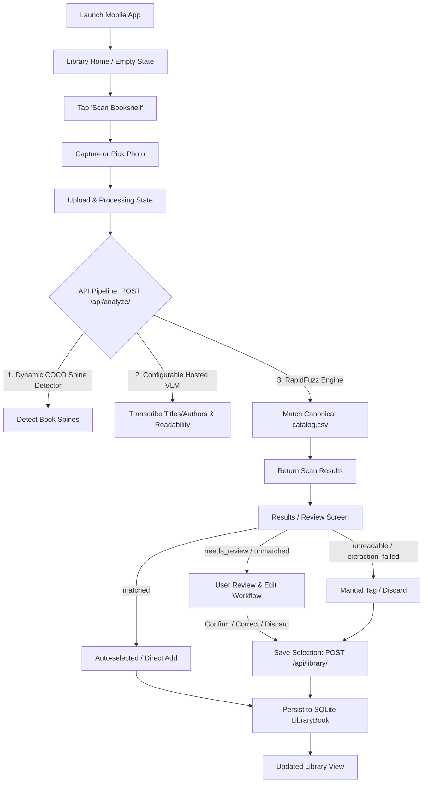

# PRODUCT REQUIREMENT DOCUMENT (PRD) — SHELFIE

## 1. PRODUCT OVERVIEW & OBJECTIVE

### 1.1 Objective
**Shelfie** is a focused mobile application and API pipeline designed to instantly turn a single photo of a physical bookshelf into a structured, verified personal library inventory.

### 1.2 Target User & Operating Context
- **User**: A book owner cataloging their personal physical library using a smartphone camera.
- **Context**: Real-world environments with variable lighting, dense bookshelf layouts, angled or worn book spines, multi-edition books, and occasional unreadable text.
- **Delivery Constraints**: Designed as an ~8-hour take-home engineering exercise to be delivered within 48 hours, evaluated via live demo, architectural Q&A, and live code modification.

---

## 2. USER JOURNEY

1. **Capture/Pick**: User opens Shelfie and takes a photo of a bookshelf (or selects one from the camera roll).
2. **Scan & Process**: App posts image to `POST /api/analyze/`. Backend runs local CPU detection (YOLO26n candidate with dynamic class lookup), crops individual book spines, queries hosted VLM (Gemini 2.5 Flash via OpenRouter with configurable batch size) for raw transcriptions and legibility, and executes deterministic matching against `catalog.csv`.
3. **Review**: App presents extracted items categorized into 5 explicit states:
   - **`matched`**: Strong, unambiguous catalog match. Presented and pre-selected in the review workflow for direct addition. Requires explicit user action to persist.
   - **`needs_review`**: Plausible candidate exists, but confidence or runner-up margin is insufficient. User confirms or selects alternate candidate.
   - **`unmatched`**: Extraction succeeded, but no plausible catalog entry found. User searches catalog or manually edits.
   - **`unreadable`**: Crop processed successfully, but spine text is degraded/illegible. User can search catalog or type details manually.
   - **`extraction_failed`**: VLM timeout or provider processing error on specific crop. User can retry or manually tag.
4. **Persist & View**: Confirmed books are posted to `POST /api/library/` and saved to SQLite (`LibraryBook` model). Viewable in personal library list (`GET /api/library/`).

---

## 3. ASSIGNMENT REQUIREMENTS & TRACEABILITY MATRIX

| Requirement ID | Assignment PDF Source | Requirement Summary | Implementation Strategy |
| :--- | :--- | :--- | :--- |
| **REQ-01** | Page 2, Stack Table | Frontend: React Native + Expo | Expo SDK with TypeScript |
| **REQ-02** | Page 2, Stack Table | Backend: Django + Django REST Framework | Python Django REST API with SQLite (`LibraryBook` model) |
| **REQ-03** | Page 2, Stack Table | Local Model: Pretrained off-the-shelf, CPU inference | Ultralytics YOLO26n candidate (dynamic `model.names` lookup for `book`, AGPL-3.0 portfolio tradeoff) |
| **REQ-04** | Page 2, Stack Table | Vision-language model: Hosted provider | OpenRouter API (`google/gemini-2.5-flash`) with configurable `VLM_BATCH_SIZE` |
| **REQ-05** | Page 2, Catalog | Messy Catalog (`catalog.csv`): At least 100 entries with title, author, alternate titles | File-backed 100+ entry CSV with real-world edge cases loaded into in-memory index |
| **REQ-06** | Page 3, Check #1 | Matching logic beyond exact string comparison | RapidFuzz title/author/alias scoring + provisional ambiguity margin testing |
| **REQ-07** | Page 3, Check #2 | Local vs Hosted boundary explicit + measured latency and API cost in README | Backend timers & token counters (`TBD — measured during benchmark phase`) |
| **REQ-08** | Page 3, Check #3 | Human-in-the-loop review workflow for low confidence / unmatched items | Dedicated interactive Review Screen prior to DB persistence |
| **REQ-09** | Page 3, Check #4 | Graceful failure on timeout, malformed JSON, 0 books detected, unreadable spines | Granular per-item failure states (`extraction_failed`, `unreadable`, `unmatched`) |
| **REQ-10** | Page 3, Deliverables | Tested photos, working clean clone README, AI_USAGE.md | Local test assets, setup scripts, full AI disclosure log (`docs/source/` ignored in Git) |

---

## 4. FUNCTIONAL REQUIREMENTS

### 4.1 Photo Ingestion & Upload
- App shall allow capturing a photo via mobile camera or selecting an existing photo from library.
- Backend `POST /api/analyze/` endpoint shall accept multipart image uploads (`JPEG`/`PNG`).
- Image payload validation: Maximum size 10MB, acceptable MIME types enforced.

### 4.2 Local Computer Vision Spine Detection
- Backend service shall run local CPU inference using pretrained YOLO26n (candidate model).
- Dynamically resolve the `book` class ID from `model.names` (e.g. class 73 in COCO) rather than hard-coding numeric IDs.
- Development-time evaluation workflow:
  1. Test YOLO26n on real bookshelf photographs.
  2. Measure visible spine count, usable crop recall, false positives, and CPU latency.
  3. If recall is inadequate, evaluate YOLO26s.
  4. If closed-set COCO detector fails to separate spines, time-box evaluation of `IDEA-Research/grounding-dino-tiny` using prompt `"book spine"`.
  5. Select ONE final detector for submission.
- Crop detected bounding box coordinates into sub-images with stable `crop_id`.
- Handle zero-detection fallback (return clean response with 0 detected items without crashing).

### 4.3 Hosted VLM Spine Transcription
- Backend service shall send detected spine crops to OpenRouter (`google/gemini-2.5-flash`).
- Use configurable batch size `VLM_BATCH_SIZE` (default initial hypothesis: 5 crops per request).
- API request must enforce strict JSON output schema containing: `crop_id`, `title`, `author`, and `readability` (`high`, `medium`, `low`, `unreadable`).
- If VLM request times out or returns malformed JSON for a batch, mark affected items as `extraction_failed` (do NOT mark as `unreadable`, and do NOT fail remaining crops).

### 4.4 Deterministic Catalog Matching Engine
- Backend service shall parse and load `catalog.csv` into an in-memory indexed representation on server startup.
- VLM extraction certainty is explicitly decoupled from catalog match confidence (`VLM extraction certainty != catalog match confidence`).
- Normalize text (lowercasing, punctuation stripping, accent normalization, whitespace trimming).
- Evaluate similarity against canonical title, alternate titles, canonical author, and author aliases.
- Provisional scoring hypothesis (to be calibrated against catalog edge cases in Phase 2):
  - Weighted composite score: $S = 0.65 \times S_{title} + 0.35 \times S_{author}$.
  - Candidate margin: $\Delta = S_1 - S_2$.
- Categorize into explicit item states:
  - **`matched`**: $S_1 \ge 0.82$ AND $\Delta \ge 0.15$ (Provisional hypothesis).
  - **`needs_review`**: $S_1 \ge 0.50$ but fails matched criteria.
  - **`unmatched`**: $S_1 < 0.50$.

### 4.5 Human-in-the-Loop Review Experience
- Mobile UI shall display an interactive review list divided into:
  - **Auto-Confirmed Matches (`matched`)**: Pre-selected. User can confirm with 1 tap.
  - **Needs Review (`needs_review`)**: Shows top candidate with option to change match via `POST /api/match/` or select alternate.
  - **Unmatched (`unmatched`)**: Allows catalog search or manual detail entry.
  - **Unreadable / Failed (`unreadable` / `extraction_failed`)**: Allows manual catalog search, manual typing, or discarding item.
- Actions per item: `Confirm`, `Change Match`, `Edit Details`, `Discard`.

### 4.6 Library Persistence & Management
- Confirmed items shall be posted to `POST /api/library/` (supports batch submission) and saved to SQLite (`LibraryBook` model).
- `catalog.csv` remains file-backed; scan/review state remains transient (no ORM models for `CatalogEntry`, `ScanSession`, or `ScanItem`).
- Mobile `Library Screen` shall fetch confirmed books via `GET /api/library/`.

---

## 5. NON-FUNCTIONAL REQUIREMENTS & TARGET PERFORMANCE

- **Performance Metrics**: All latency and cost metrics are marked as `TBD — measured during benchmark phase`.
- **Target Performance Budgets**:
  - Target CPU Inference Latency: $< 1.5$ seconds per bookshelf image.
  - Target Hosted VLM Latency: $< 3.0$ seconds total.
  - Target Total Roundtrip Latency: $< 6.0$ seconds.
  - Target Scan Cost Budget: $< \$0.005$ per bookshelf scan.
- **Reliability**: App must never crash or display blank screens on network errors, invalid API keys, malformed VLM outputs, or 0 detected books.
- **Offline / Local Degradation**: If VLM API key is missing or network fails, affected crops transition to `extraction_failed`, permitting manual tagging.

---

## 6. EXPLICIT NON-GOALS & SCOPE CUTS

To guarantee delivery within the 8-hour development budget, the following features are **EXPLICITLY DEFERRED / OUT OF SCOPE**:

1. **User Authentication & Profiles**: Single local user assumption. No login/signup/JWT flows.
2. **Cloud Deployment / Hosting**: Application runs locally via Expo dev client / server and Django `manage.py runserver`.
3. **ORM Persistence for Catalog & Transient Scan Sessions**: `catalog.csv` is file-backed; scan state is transient. Only confirmed library books are persisted in SQLite (`LibraryBook`).
4. **Automatic Runtime Model Switching**: Single detector chosen at development time after benchmarking. No complex runtime switching logic.
5. **Custom Model Fine-tuning**: Zero YOLO training or custom VLM fine-tuning.
6. **Social & Community Features**: No sharing, public profiles, reading lists, or social feeds.
7. **Third-party External APIs**: No live Goodreads/Google Books API calls. The local `catalog.csv` is the sole source of truth.

---

## 7. EVALUATION & GRADING ALIGNMENT

| Grading Focus (PDF Page 4) | Shelfie PRD Strategy |
| :--- | :--- |
| **Judgment under deadline** | Strict scope control, minimal API surface, file-backed catalog, transient scan state. |
| **Pipeline thinking (Cost/Latency/Failure)** | Stage timers; empirical latency/cost measured during benchmark phase; 5 distinct failure/product states. |
| **Non-exact matching** | RapidFuzz scoring over titles, alternate titles, authors, aliases, missing fields, and calibrated ambiguity margins. |
| **Messy catalog design** | 100+ entry CSV intentionally seeded with 6 required ambiguity patterns (duplicate titles, omnibus, aliases, US/UK titles, substrings). |
| **Human-in-the-loop UX** | Interactive review screen treating AI uncertainty as a core product state. |
| **Explainable code** | Clean, modular Python/TypeScript services with dynamic class lookup and explicit architectural boundaries. |
